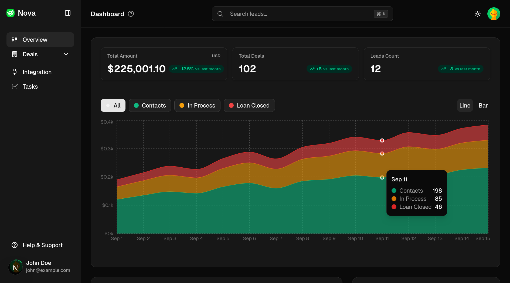

# Nova CRM 🚀

[](https://nextjs.org/)
[](https://tailwindcss.com/)
[](https://www.typescriptlang.org/)
[](https://opensource.org/licenses/MIT)

Nova CRM is a high-performance, modern Customer Relationship Management platform designed for seamless lead management, performance tracking, and actionable business insights. Built with the latest web technologies, it offers a premium user experience with real-time data visualization and a sleek, responsive interface.



## ✨ Features

- **📊 Dynamic Dashboard**: Real-time visualization of business performance using interactive charts.
- **📈 Advanced Analytics**: Revenue tracking and lead conversion metrics with Recharts.
- **📋 Lead Management**: Comprehensive pipeline management with detailed lead profiles and status tracking.
- **🎯 Task Tracking**: Organized task management system to keep teams on track.
- **🔍 Intelligent Search**: Global command-style search (CMDK) for quick access to any data.
- **🌓 Dark/Light Mode**: Premium aesthetic with full system-aware theme support.
- **📱 Responsive Design**: Fully optimized for mobile, tablet, and desktop environments.

## 🛠️ Tech Stack

- **Framework**: [Next.js 15 (App Router)](https://nextjs.org/)
- **Styling**: [Tailwind CSS 4.0](https://tailwindcss.com/)
- **UI Components**: [Radix UI](https://www.radix-ui.com/) & [Lucide Icons](https://lucide.dev/)
- **Charts**: [Recharts](https://recharts.org/)
- **Language**: [TypeScript](https://www.typescriptlang.org/)
- **Runtime**: [Bun](https://bun.sh/)

## 📂 Project Structure

```text
├── app/              # Next.js App Router routes & pages
├── components/       # Reusable UI & Business components
│   ├── dashboard/    # Visualization cards & tables
│   ├── lead-detail/  # Detailed lead view modules
│   └── ui/           # Shared shadcn/ui components
├── hooks/            # Custom React hooks
├── lib/              # Utility functions and mock data
├── public/           # Static assets (images, logos)
└── types/            # TypeScript interface definitions
```

## 🚀 Getting Started

### Prerequisites

- [Bun](https://bun.sh/) (Recommended) or Node.js

### Installation

1. **Clone the repository:**
   ```bash
   git clone https://github.com/your-username/novacrm.git
   cd novacrm
   ```

2. **Install dependencies:**
   ```bash
   bun install
   ```

3. **Run the development server:**
   ```bash
   bun dev
   ```

4. **Open the app:**
   Navigate to [http://localhost:3000](http://localhost:3000) to see the dashboard.

## 📄 License

This project is licensed under the MIT License - see the [LICENSE](LICENSE) file for details.

---

Built with ❤️ by [Nithish](https://github.com/niiithish)

